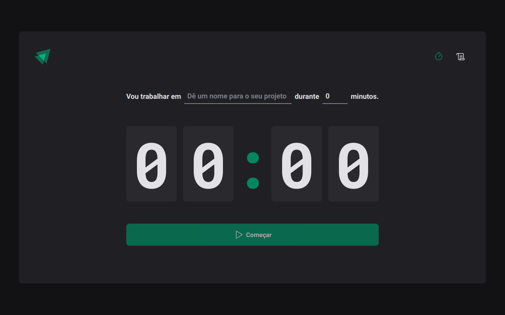

<h1>
  
  Ignite Timer
</h1>

Front-end do aplicativo desenvolvido no módulo 02 da jornada Ignite [Rocketseat Ignite](https://www.rocketseat.com.br/ignite).

## Características

Este front-end apresenta as ferramentas e práticas mais recentes em desenvolvimento web!

- ⚛️ **React** — Uma biblioteca para construir interfaces de usuário
- 💅 **CSS** — styled-components
- 💖 **Lint** — ESlint/Prettier/Editor Config

Eu usei outras bibliotecas também, como:

- **react-router** — roteamento padrão do React
- **date-fns** — para datas
- **immer** — estado imutável de uma maneira mais conveniente
- **zod** — validação e declaração 

## Projeto 

Nesse projeto, foi desenvolvido uma aplicação completa com roteamentos e diversos conceitos importantes do ecossistema React como:

- Hook Form
- ContextAPI
- useReducer
